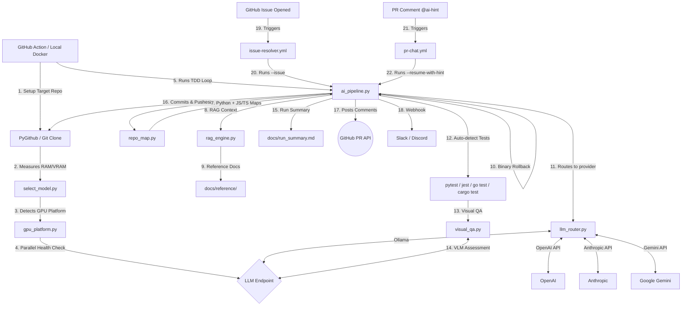

# Technical Architecture

## 1. System Overview
The pipeline is designed to be highly modular. By migrating away from bulky Hugging Face `transformers` modules, the architecture separates the "Thinker" (the LLM server) from the "Orchestrator" (the CI scripts). The LLM Router (`scripts/llm_router.py`) abstracts all provider-specific APIs behind a single `generate()` call.

## 2. Component Diagram

## 3. Hardware Intelligence Layer
Located in `scripts/select_model.py`.
Standard LLMs require monolithic VRAM which causes Actions runners to crash. This layer intercepts the environment before Ollama boots, detects the `/proc/meminfo` or `sysctl`, and exports `OLLAMA_MODEL`. 
- `qwen2.5-coder:32b` (>32GB Memory Envelope)
- `deepseek-coder:6.7b` (>14GB Memory Envelope)
- `qwen2.5-coder:3b` (<14GB standard runner envelope)

## 4. LLM Provider Router (`scripts/llm_router.py`)
The pipeline is no longer locked to Ollama. A provider-agnostic router supports:

| Provider | Env Vars | Streaming |
|----------|----------|-----------|
| Ollama (default) | `OLLAMA_URL`, `OLLAMA_MODEL` | ✅ Yes |
| OpenAI (GPT-4o) | `LLM_PROVIDER=openai`, `OPENAI_API_KEY` | ✅ Yes |
| Anthropic (Claude) | `LLM_PROVIDER=anthropic`, `ANTHROPIC_API_KEY` | ❌ Batch |
| Google Gemini | `LLM_PROVIDER=gemini`, `GOOGLE_API_KEY` | ❌ Batch |

Falls back to Ollama automatically if API keys are not set.

## 5. RAG Context Engine (`scripts/rag_engine.py`)
Retrieval-Augmented Generation improves code quality for smaller models by injecting reference documents into prompts:
1. **Indexing:** Scans `your_project/docs/reference/` for `.md`, `.txt`, `.json`, `.yaml`, `.py`, `.js`, `.ts` files.
2. **Chunking:** Splits documents into ~500-char overlapping chunks.
3. **Retrieval:** TF-IDF cosine similarity finds the top-5 most relevant chunks for each task.
4. **Injection:** Relevant chunks are prepended to the engineer prompt as `--- REFERENCE DOCUMENTS (RAG) ---`.
5. **Caching:** Directory hash prevents re-indexing unless files change.

Zero external dependencies — can be upgraded to ChromaDB or FAISS for larger document sets.

## 6. Context Window Optimization (`scripts/repo_map.py`)
Prevents context window collapse on large projects:
- **Python:** Parses using `ast` module to extract class definitions, function signatures, and docstrings.
- **JS/TS:** Regex-based extraction of function declarations, arrow functions, class declarations, and method definitions.
- **Other files:** Listed without content for structural awareness.

The Engineer Agent receives this compressed map alongside the persistent `docs/requirements.md` and RAG context. A two-step discovery prompt asks the LLM which files it needs in full — reducing token usage by ~90%.

## 7. Remediation Loop (`ai_pipeline.py`)
1. **Repository Setup:** PyGithub creates a new remote repository or clones an existing one.
2. **Persistent Tracking:** The system saves the initial prompt to `docs/requirements.md` and generates actionable steps in `project_tasks.md`. On re-runs, it appends new goals and dynamically updates the checklist without destroying completed tasks.
3. **AST Repo Map:** Generates compressed codebase structure via `repo_map.py` (Python AST + JS/TS regex).
4. **Two-Step Discovery:** Asks the LLM which files it needs before loading them. Results are cached across retry iterations.
5. **RAG Context:** Retrieves relevant reference document chunks for prompt enrichment.
6. **Streaming Generation:** Responses streamed via `iter_lines()` using list-join accumulation (O(n) instead of O(n²)).
7. **Strict Regex Extraction:** Parses the AI output using Regex to cleanly strip conversational fluff and markdown ticks.
8. **Elapsed Time Tracking:** Each iteration prints wall-clock time (e.g., `⏱ Iteration 2/5 completed in 47s`).
9. **Auto-Detect Test Framework:** Automatically selects `pytest`, `jest`, `go test`, or `cargo test` based on project files.
10. **Analysis Execution:** Runs test framework inside an automated feedback loop. If tests fail, the orchestrator reverts via `git reset` and feeds the stack trace back, repeating up to `MAX_TDD_ITERATIONS` (configurable via env var, default: 5).
11. **Run Summary:** Auto-generates `docs/run_summary.md` with coverage, pass rate, completed/failed tasks, and elapsed time.
12. **Writing & Pushing:** Writes generated files and pushes to `TARGET_REPO`. Skipped in `--dry-run` mode.
13. **Webhook Notification:** Posts summary to Slack/Discord if `WEBHOOK_URL` is configured.

## 8. Autonomous Issue Resolution
Workflow `issue-resolver.yml` triggers on `issues: [opened]`. It runs `ai_pipeline.py --issue` which:
1. Reads issue title/body from environment
2. Creates a `fix-issue-{id}` branch
3. Checks for existing `project_tasks.md` — if found, uses `update_task_plan()` to preserve state; otherwise generates fresh
4. Executes the TDD loop to fix the bug
5. Automatically opens a Pull Request via PyGithub with `Resolves #{id}`

## 9. Human-in-the-Loop PR Chat
When the TDD loop exhausts `max_iterations`, it posts a PR comment asking for help. Users reply with `@ai-hint <guidance>`. The `pr-chat.yml` workflow picks up the comment and runs `ai_pipeline.py --resume-with-hint`, injecting the user's hint into the Engineer's prompt.

## 10. Visual Quality Assurance (`scripts/visual_qa.py`)
Optionally screenshots generated HTML using Playwright (with Selenium fallback) and submits the image to an Ollama Vision model (e.g., `llava`) for aesthetic assessment.

## 11. GPU Platform Intelligence (`scripts/gpu_platform.py`)
- **Parallel Health Checks:** Uses `ThreadPoolExecutor` to ping all configured platforms simultaneously (up to 10× faster than sequential).
- **Failover Chain:** Automatically tries configured platforms (Colab, Kaggle, etc.) in priority order.
- **Cost Tracking:** `estimate_gpu_cost()` calculates estimated spend for paid platforms.
- **Universal Routing:** Dynamically exports `OLLAMA_URL` at module startup.

## 12. Auto-Rollback & State Management
- **Pre-emptive Checkpointing:** `save_rollback_point()` captures the git HEAD before any AI modification.
- **Regression Detection:** `rollback_if_worse()` compares current test failures against the checkpoint. If failures increase, it executes a hard git reset.

## 13. Security Toolchain
- **Python:** `bandit` - Scans AST for hardcoded credentials, eval(), injections.
- **NodeJS:** `njsscan` - Scans Server-Side JavaScript logic.
- **Go:** `gosec` - Abstract Syntax Tree security inspector for Golang.
- **Sandboxing:** Path traversal protection via `safe_path()` using `os.path.realpath`.
- **Secrets Masking:** All subprocess outputs are filtered through `mask_secret()` to prevent token leaks in CI logs.
