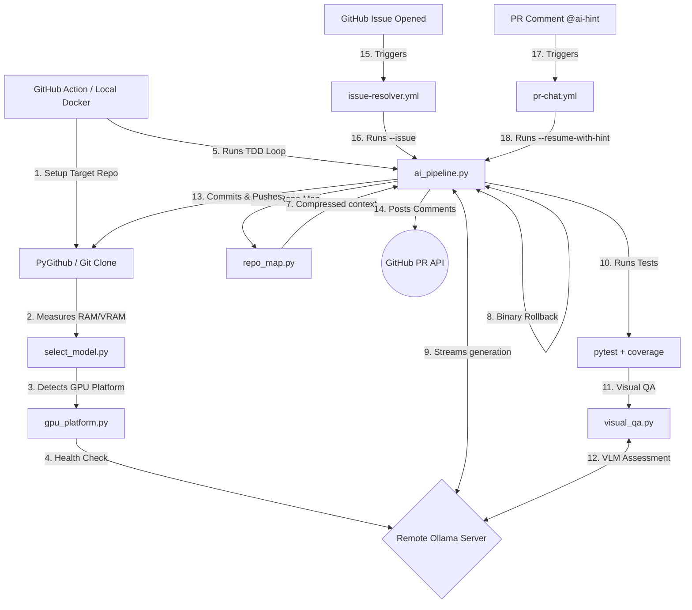

# Technical Architecture

## 1. System Overview
The pipeline is designed to be highly modular. By migrating away from bulky Hugging Face `transformers` modules, the architecture separates the "Thinker" (the LLM server) from the "Orchestrator" (the CI scripts). 

## 2. Component Diagram

## 3. Hardware Intelligence Layer
Located in `scripts/select_model.py`.
Standard LLMs require monolithic VRAM which causes Actions runners to crash. This layer intercepts the environment before Ollama boots, detects the `/proc/meminfo` or `sysctl`, and exports `OLLAMA_MODEL`. 
- `qwen2.5-coder:32b` (>32GB Memory Envelope)
- `deepseek-coder:6.7b` (>14GB Memory Envelope)
- `qwen2.5-coder:3b` (<14GB standard runner envelope)

## 4. Context Window Optimization (`scripts/repo_map.py`)
Prevents context window collapse on large projects by parsing Python files using `ast` module to extract:
- Class definitions with base classes
- Function/method signatures with argument names
- First-line docstrings (truncated to 60 chars)

The Engineer Agent receives this compressed map instead of raw file contents. A two-step discovery prompt asks the LLM which files it needs in full, then only those specific files are loaded — reducing token usage by ~90%.

## 5. Remediation Loop (`ai_pipeline.py`)
1. **Repository Setup:** PyGithub creates a new remote repository or clones an existing one.
2. **AST Repo Map:** Generates compressed codebase structure via `repo_map.py`.
3. **Two-Step Discovery:** Asks the LLM which files it needs before loading them.
4. **Analysis Execution:** Runs `pytest`, `pylint`, `eslint`, `golint`, and security scanners.
5. **Visual QA:** Screenshots generated HTML via Playwright and assesses aesthetics with a Vision LLM.
6. **Streaming Generation:** Responses streamed via `iter_lines()` to prevent CI stalling.
7. **Writing & Pushing:** Writes generated files and pushes to `TARGET_REPO`.

## 6. Autonomous Issue Resolution
New workflow `issue-resolver.yml` triggers on `issues: [opened]`. It runs `ai_pipeline.py --issue` which:
1. Reads issue title/body from environment
2. Creates a `fix-issue-{id}` branch
3. Executes the TDD loop to fix the bug
4. Automatically opens a Pull Request via PyGithub with `Resolves #{id}`

## 7. Human-in-the-Loop PR Chat
When the TDD loop exhausts `max_iterations`, it posts a PR comment asking for help. Users reply with `@ai-hint <guidance>`. The `pr-chat.yml` workflow picks up the comment and runs `ai_pipeline.py --resume-with-hint`, injecting the user's hint into the Engineer's prompt.

## 8. Visual Quality Assurance (`scripts/visual_qa.py`)
Optionally screenshots generated HTML using Playwright (with Selenium fallback) and submits the image to an Ollama Vision model (e.g., `llava`) for aesthetic assessment. Evaluates layout, color, typography, and overall appeal on a 10-point scale.

## 9. GPU Platform Intelligence (`scripts/gpu_platform.py`)
This layer handles the discovery and failover of LLM endpoints.
- **Failover Chain:** Automatically tries configured platforms (Colab, Kaggle, etc.) in priority order.
- **Health Checks:** Performs a REST ping to the `/api/tags` endpoint to verify liveness before routing traffic.
- **Universal Routing:** Dynamically exports `OLLAMA_URL` at module startup for all other components.

## 10. Auto-Rollback & State Management
Located in `ai_pipeline.py`.
- **Pre-emptive Checkpointing:** `save_rollback_point()` captures the git HEAD before any AI modification.
- **Regression Detection:** `rollback_if_worse()` compares current test failures against the checkpoint. If failures increase, it executes a hard git reset to restore stability.

## 11. Security Toolchain
- **Python:** `bandit` - Scans AST for hardcoded credentials, eval(), injections.
- **NodeJS:** `njsscan` - Scans Server-Side JavaScript logic.
- **Go:** `gosec` - Abstract Syntax Tree security inspector for Golang.
- **Sandboxing:** Path traversal protection via `safe_path()` using `os.path.realpath`.
- **Secrets Masking:** All subprocess outputs are filtered through `mask_secret()` to prevent token leaks in CI logs.
