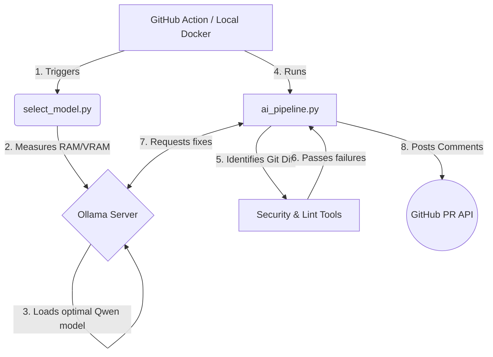

# Technical Architecture

## 1. System Overview
The pipeline is designed to be highly modular. By migrating away from bulky Hugging Face `transformers` modules, the architecture separates the "Thinker" (the LLM server) from the "Orchestrator" (the CI scripts). 

## 2. Component Diagram

## 3. Hardware Intelligence Layer
Located in `scripts/select_model.py`.
Standard LLMs require monolithic VRAM which causes Actions runners to crash. This layer intercepts the environment before Ollama boots, detects the `/proc/meminfo` or `sysctl`, and exports `OLLAMA_MODEL`. 
- `qwen2.5-coder:32b` (>32GB Memory Envelope)
- `deepseek-coder:6.7b` (>14GB Memory Envelope)
- `qwen2.5-coder:3b` (<14GB standard runner envelope)

## 4. Remediation Loop (`ai_pipeline.py`)
1. **Extraction:** Discovers changed source lines via `git diff origin/main...HEAD`.
2. **Analysis Execution:** Runs `pylint`, `eslint`, `golint`, and strict security scanners locally.
3. **AI Injection:** Directly appends `stderr/stdout` of the tool output into a unified prompt.
4. **Writing:** Cleans the LLM's Markdown output and forcefully overwrites the source file.

## 5. Security Toolchain
- **Python:** `bandit` - Scans AST for hardcoded credentials, eval(), injections.
- **NodeJS:** `njsscan` - Scans Server-Side JavaScript logic.
- **Go:** `gosec` - Abstract Syntax Tree security inspector for Golang.
