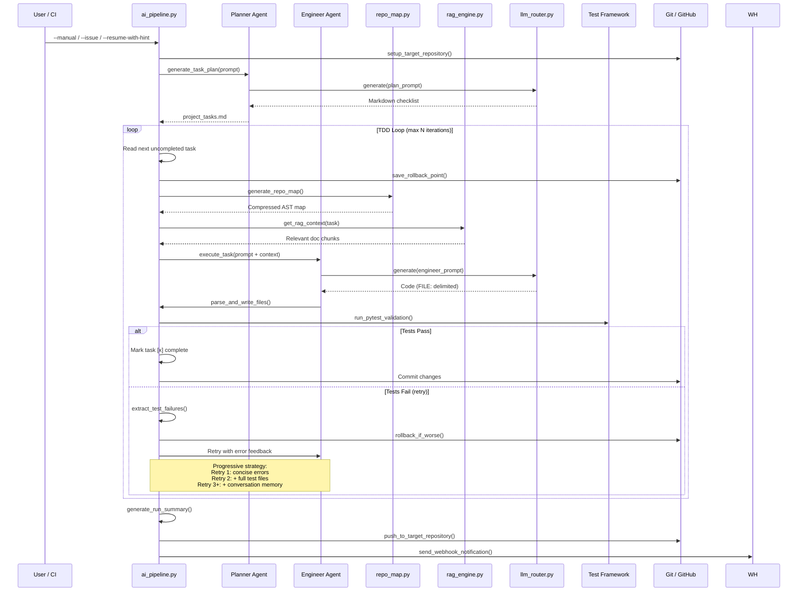
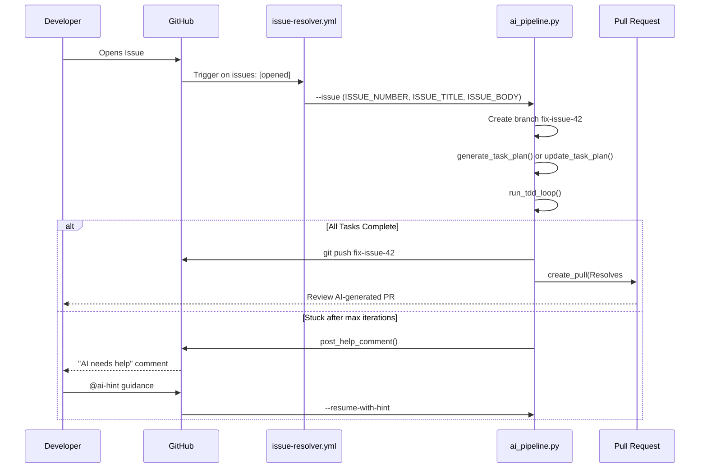
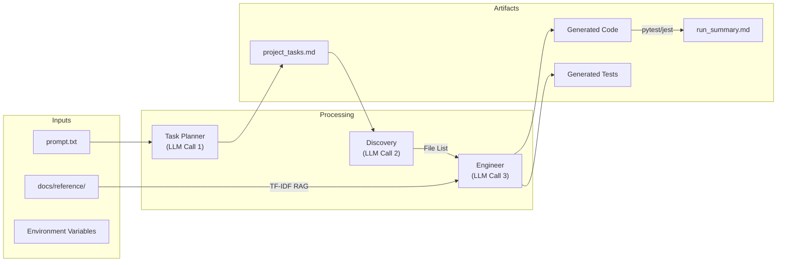

# Technical Architecture

## 1. System Overview

The AI TDD Orchestrator is a fully autonomous code generation, testing, and remediation pipeline. It separates the **Thinker** (LLM server) from the **Orchestrator** (CI scripts), using a provider-agnostic `llm_router.py` that routes to Ollama, OpenAI, Anthropic, Google Gemini, Groq, or Cerebras behind a single `generate()` call.

Key design principles:
- **Zero-shot autonomy**: Generates task plans from natural language, writes code, runs tests, and fixes failures iteratively
- **Provider agnostic**: Works with any LLM backend via environment variables
- **TDD-first**: Every code change must pass `pytest --cov-fail-under=90` before being committed
- **Self-healing**: Auto-rollback on regressions, progressive retry strategies, human-in-the-loop escalation

---

## 2. High-Level Component Diagram

```mermaid
graph TD
    %% Define Styles
    classDef External fill:#2D3748,stroke:#4A5568,color:#fff
    classDef Pipeline fill:#2B6CB0,stroke:#3182CE,color:#fff
    classDef Agent fill:#C05621,stroke:#DD6B20,color:#fff
    classDef Script fill:#2C7A7B,stroke:#319795,color:#fff
    classDef Model classDef fill:#6B46C1,stroke:#805AD5,color:#fff

    subgraph "External Triggers"
        GHA["⚙️ GitHub Actions CI<br/>(Push/PR)"]:::External
        ISS["💬 Issue Opened<br/>(#42 Bug...)"]:::External
        MSG["🗣️ @ai-hint Comment<br/>In PR"]:::External
        LOC["💻 Local Terminal<br/>--manual"]:::External
    end

    subgraph "AI TDD Orchestrator"
        AP["🚀 ai_pipeline.py"]:::Pipeline
        
        subgraph "Context Engine"
            RM["📂 repo_map.py<br/>(AST/Regex + mtime Cache)"]:::Script
            RAG["📚 rag_engine.py<br/>(TF-IDF Ref Docs)"]:::Script
        end
        
        subgraph "Autonomous Agents"
            PLN["🧠 Planner Agent<br/>(project_tasks.md)"]:::Agent
            ENG["🛠️ Engineer Agent<br/>(Code & Tests)"]:::Agent
        end
        
        subgraph "Testing & Rollback"
            PYF["🧪 pytest-cov<br/>(Runs CI Suite)"]:::Pipeline
            RBT["⏪ Git Rollback<br/>(reset & clean -fd)"]:::Pipeline
        end
    end

    subgraph "Hardware & LLM Routing"
        GP["💻 gpu_platform.py<br/>(Auto VRAM Detect)"]:::Script
        LR["🔀 llm_router.py<br/>(Failover Chain)"]:::Script
        
        OLL["Ollama<br/>(Local)"]:::Model
        GRQ["Groq<br/>(~500 tok/s)"]:::Model
        CER["Cerebras<br/>(~2000 tok/s)"]:::Model
        OAI["OpenAI<br/>(GPT-4o)"]:::Model
    end

    %% Flows from Triggers
    GHA -->|"Review/Validate"| AP
    ISS -->|"--issue"| AP
    MSG -->|"--resume-with-hint"| AP
    LOC -->|"--manual"| AP

    %% Pipeline flow
    AP -->|"1. Setup target repo"| PLN
    PLN -->|"Initial Task List"| ENG
    
    ENG -.->|"Asks for specific files"| RM
    RM -.->|"Provides Structural Map"| ENG
    ENG -.->|"Lookup architecture"| RAG
    
    ENG -->|"Generates files"| PYF
    
    PYF -->|"Tests Pass?"| AP
    PYF -.->|"<90% Coverage / Fails"| RBT
    RBT -.->|"Injects Missing Lines/Logs"| ENG
    
    %% Routing
    PLN -->|"Generate"| LR
    ENG -->|"Generate"| LR
    
    LR -->|"Auto-Select Fastest/Free"| GP
    LR --> OLL
    LR --> GRQ
    LR --> CER
    LR --> OAI
```

---

## 3. TDD Loop Sequence Diagram



---

## 4. Issue Resolution Flow



---

## 5. Data Flow Diagram



---

## 6. Hardware Intelligence Layer

Located in `scripts/select_model.py` and `scripts/gpu_platform.py`.

### Model Selection Matrix

| VRAM/RAM | Selected Model | Use Case |
|----------|---------------|----------|
| ≥24 GB VRAM | `qwen2.5-coder:32b` | Local workstation with high-end GPU |
| ≥15 GB RAM | `qwen2.5-coder:7b` | Docker / mid-tier workstation |
| <15 GB RAM | `qwen2.5-coder:3b` | GitHub Free Runner (7GB) |

### Platform Detection
- **Cross-platform RAM detection**: Linux (`/proc/meminfo`), macOS (`sysctl`), Windows (`wmic`)
- **GPU VRAM**: `nvidia-smi` query
- **Parallel health checks** via `ThreadPoolExecutor` (up to 10× faster than sequential)
- **Failover chain**: Colab → Kaggle → Lightning → HuggingFace → SageMaker → Paperspace → Oracle → Vast.ai → RunPod → Custom → Local

---

## 7. LLM Provider Router (`scripts/llm_router.py`)

| Provider | Env Vars | Streaming | Connection Pooling |
|----------|----------|-----------|-------------------|
| Ollama (default) | `OLLAMA_URL`, `OLLAMA_MODEL` | ✅ Yes | ✅ Session |
| OpenAI (GPT-4o) | `LLM_PROVIDER=openai`, `OPENAI_API_KEY` | ✅ Yes | ✅ Session |
| Anthropic (Claude) | `LLM_PROVIDER=anthropic`, `ANTHROPIC_API_KEY` | ❌ Batch | ✅ Session |
| Google Gemini | `LLM_PROVIDER=gemini`, `GOOGLE_API_KEY` | ✅ SSE | ✅ Session |

**Optimizations:**
- `requests.Session` singleton with connection pooling (4 connections, 10 max)
- Exponential backoff retry (0.5s, 1s, 2s) on transient errors and 5xx responses
- Falls back to Ollama automatically if API keys are not set

---

## 8. RAG Context Engine (`scripts/rag_engine.py`)

Retrieval-Augmented Generation improves code quality for smaller models by injecting reference documents into prompts:

1. **Indexing:** Scans `your_project/docs/reference/` for `.md`, `.txt`, `.json`, `.yaml`, `.py`, `.js`, `.ts` files
2. **Chunking:** Splits documents into ~500-char overlapping chunks
3. **TF-IDF:** Proper term frequency × inverse document frequency weighting (not just TF)
4. **Retrieval:** Cosine similarity finds the top-5 most relevant chunks for each task
5. **Noise filtering:** Chunks below score threshold (0.01) are discarded
6. **Injection:** Relevant chunks prepended to engineer prompt as `--- REFERENCE DOCUMENTS (RAG) ---`
7. **Caching:** Directory hash prevents re-indexing unless files change

Zero external dependencies — can be upgraded to ChromaDB or FAISS for larger document sets.

---

## 9. Context Window Optimization (`scripts/repo_map.py`)

Prevents context window collapse on large projects:

- **Python:** `ast` module parses class definitions, function signatures, and docstrings
- **JS/TS:** Regex extraction of function declarations, arrow functions, class declarations, method definitions
- **Other files:** Listed without content for structural awareness
- **Parallel I/O:** `ThreadPoolExecutor` for repos with ≥10 files (auto-detected threshold)
- **Two-step discovery:** LLM selects which files to load in full — reducing token usage by ~90%

---

## 10. TDD Remediation Loop (`ai_pipeline.py`)

1. **Repository Setup:** PyGithub creates/clones the target repository
2. **Persistent Tracking:** Saves prompt to `docs/requirements.md`, generates `project_tasks.md` checklist
3. **AST Repo Map:** Compressed codebase structure via `repo_map.py`
4. **Two-Step Discovery:** Asks LLM which files to load. Results cached across retries
5. **RAG Context:** TF-IDF retrieves relevant reference doc chunks
6. **Streaming Generation:** Responses streamed via `iter_lines()` with list-join (O(n))
7. **Strict Regex Extraction:** Compiled regex patterns extract code from LLM output
8. **Pre-write Syntax Validation:** `ast.parse()` validates Python before disk write
9. **Progressive Retry Strategy:**
   - Retry 1: Concise error summary only
   - Retry 2: + Full test file contents
   - Retry 3+: + Conversation memory + "try completely different approach"
10. **Auto-Detect Test Framework:** pytest / jest / go test / cargo test
11. **Smart Error Extraction:** Pulls only assertion errors and key failures (not full tracebacks)
12. **pytest --lf on retries:** Only re-runs failing tests for speed
13. **Auto-Rollback:** `git reset --hard` if AI changes increase failures
14. **Run Summary:** Auto-generates `docs/run_summary.md`
15. **Webhook Notification:** Slack/Discord via `WEBHOOK_URL`

---

## 11. Visual Quality Assurance (`scripts/visual_qa.py`)

Optionally screenshots generated HTML using Playwright (with Selenium fallback) and submits the image to an Ollama Vision model (e.g., `llava`) for aesthetic assessment. Scores: layout, color, typography, overall appeal.

---

## 12. Autonomous Issue Resolution

Workflow `issue-resolver.yml` triggers on `issues: [opened]`:
1. Reads issue title/body from environment
2. Creates a `fix-issue-{id}` branch
3. Checks for existing `project_tasks.md` — preserves state or generates fresh
4. Executes the TDD loop
5. Opens a Pull Request via PyGithub with `Resolves #{id}`

---

## 13. Human-in-the-Loop PR Chat

When the TDD loop exhausts `max_iterations`, it posts a PR comment asking for help. Users reply with `@ai-hint <guidance>`. The `pr-chat.yml` workflow runs `--resume-with-hint`, injecting the hint into the Engineer's prompt.

---

## 14. Security Toolchain

- **Sandboxing:** Path traversal protection via `safe_path()` using `os.path.realpath`
- **Secrets Masking:** All outputs filtered through `mask_secret()` to prevent token leaks in CI logs
- **Git Timeout:** 120s timeout prevents infinite CI hangs
- **Pre-write validation:** Python syntax checked before disk write
